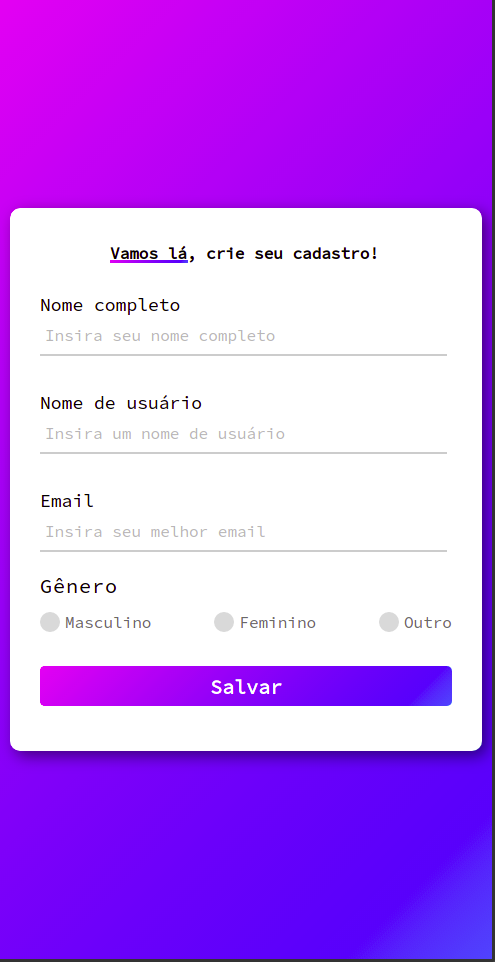
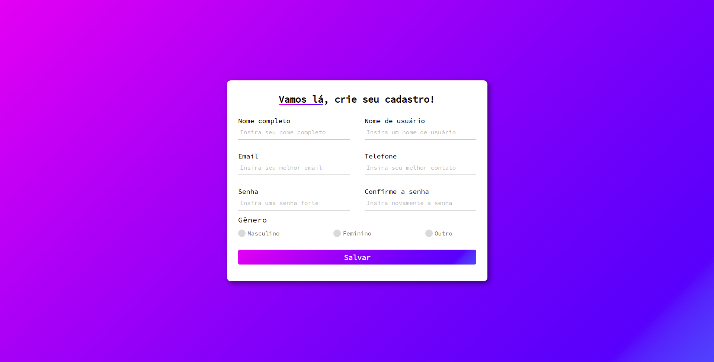

# Forms examples

## Example 2
                                                            
 <table>
  <tr>
    <td>
      
    </td>
    </td>
        
 
              Tela de login, responsiva, com vários efeitos visuais, como borda inferior de cada input 'acendendo' ao ser clicada e alterando de cor caso o campo                 tenha sido devidamente preenchido. Botão de salvar com efeito reversivo do background ao passar do mouse. Validação de todos os campos com alert                     informando quando clicar em salvar sem que todos estejam preenchidos.
              <ul>
                  Desenvolvida em:
                  <li>HTML 
                  <li>CSS 
              </ul>
        

    </td>
    <td>
         
    </td>
  </tr>
</table>                                                        

